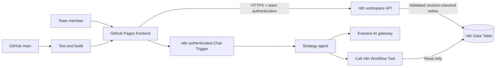

# AI Vision Studio

An English-language team workspace for AI vision, objectives and key results, target-picture design, skills and role capability assessment.

Frontend: https://florianliepe.github.io/AI-Skill-Heatmap/

## Included

- AI Design Workbench: opportunity capture, linked use cases, process × capability heatmap, evidence coverage, comparison, editable value assumptions, experiments, observations and team enablement.
- Five-step case editor with explicit saves, navigation guards, conflict reconciliation and printable decision briefs. Open **Workbench → Explore an example** for an isolated, fictional demonstration.
- Editable vision, strategic objectives, key results and an outcome dashboard.
- Drag-and-connect target-picture canvas with editable current/target states, owners and work modes.
- Searchable skill catalog, four proficiency anchors, priority scores and governance status.
- Role profiles, editable role-skill targets, current proficiency and gap heatmaps, priority bubble chart.
- Shared asynchronous create/read/update/delete operations, validation, revision conflict detection and a bounded activity history.
- Password landing page with backend-enforced authentication. Credentials are held in browser memory and cleared on logout or reload; inactivity signs the user out after 30 minutes.
- Integrated n8n Chat Trigger → AI Agent → Call n8n Workflow Tool → read-only strategy context. Suggestions do not change application records.
- GitHub Actions tests, build and Pages deployment on pushes to `main`.

## Architecture

GitHub Pages serves static application code and branding only. Workspace content is stored in a private n8n Data Table and fetched after authentication. The source workbooks, populated JSON, team password and gateway key are **not** part of the public repository or frontend bundle.



## Development

Requires Node.js 22+ and npm.

```sh
npm ci
npm run dev
npm test
npm run build
```

The development UI uses the configured n8n backend. It has no public demo password or local fallback that bypasses authentication. The local URL is `http://127.0.0.1:5173/AI-Skill-Heatmap/`.

## Operations

See [the operations guide](docs/OPERATIONS.md), [data model](docs/DATA_MODEL.md), [goal and acceptance criteria](docs/GOAL.md), and [research decisions](docs/RESEARCH.md).

`n8n/*.template.json` contains portable workflow templates with placeholder table/credential IDs. Populate these in the authenticated n8n project before publishing. Deployment scripts use credentials stored outside the repository; they never print those credentials.

Actual KPI values and current skill proficiency start unmeasured. Seed objectives and targets are planning hypotheses and must be validated by their owners. The specialised source import provides 40 skills, 10 role profiles and 80 proposed role-skill targets, enriched by matching knowledge-base definitions. The import leaves source files unchanged.
